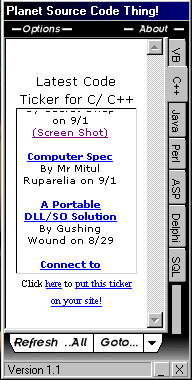

## Planet Source Code Thing 1\.1

### Description

This shows the "newest code ticker" for each language on PSC within one program. It also allows you to search PSC with ease among a few other search engines. I really made this for me but I thought other ppl might like it. Please vote/leave feedback if you like it. (System tray and intellisense code taken from PSC, thanks guys!) NEW IN THIS VERSION - Updated look, you can select visible tabs and it saves settings in the registry now.
 
### More Info
 

             |
---                |---
**Submitted On**   |2000-09-03 02:57:34
**By**             |[MaskingTape](https://github.com/Planet-Source-Code/PSCIndex/blob/master/ByAuthor/maskingtape.md)
**Level**          |Beginner
**User Rating**    |4.8 (29 globes from 6 users)
**Compatibility**  |VB 6\.0
**Category**       |[Internet/ HTML](https://github.com/Planet-Source-Code/PSCIndex/blob/master/ByCategory/internet-html__1-34.md)
**World**          |[Visual Basic](https://github.com/Planet-Source-Code/PSCIndex/blob/master/ByWorld/visual-basic.md)
**Archive File**   |[CODE\_UPLOAD9559932000\.zip](https://github.com/Planet-Source-Code/maskingtape-planet-source-code-thing-1-1__1-11214/archive/master.zip)

